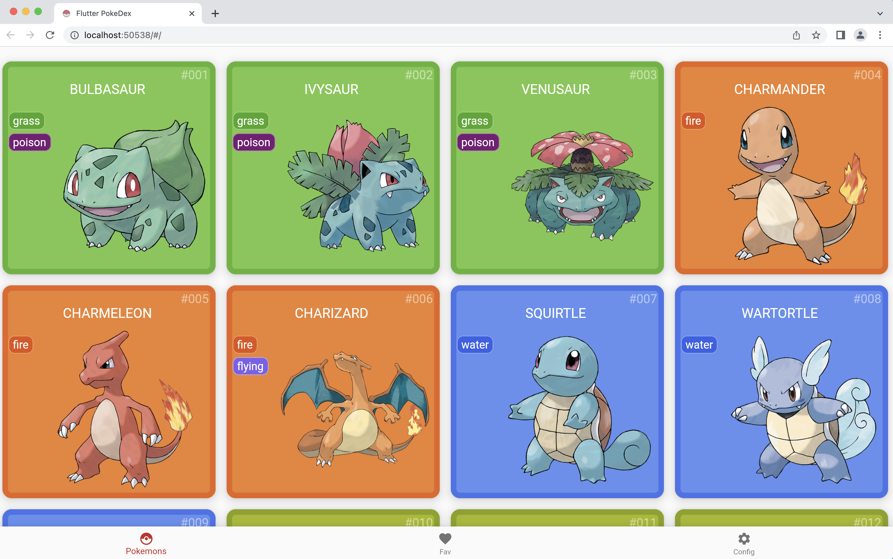
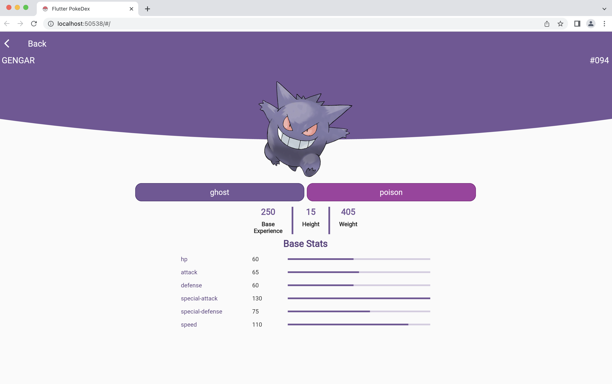
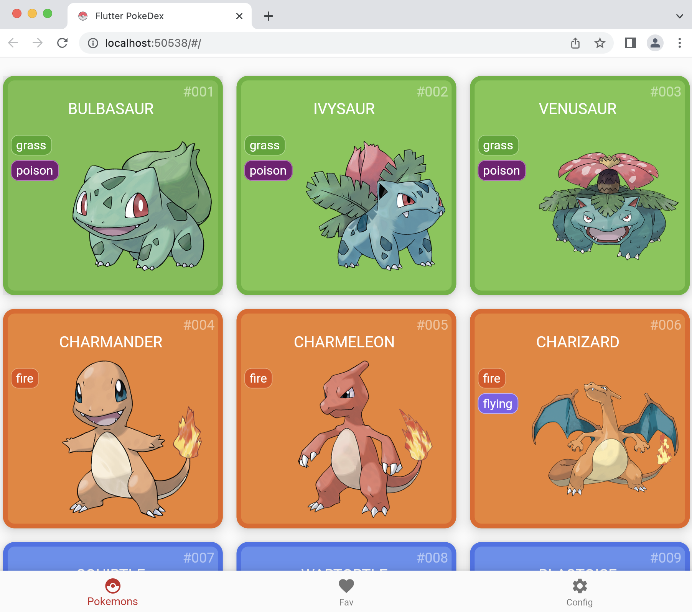
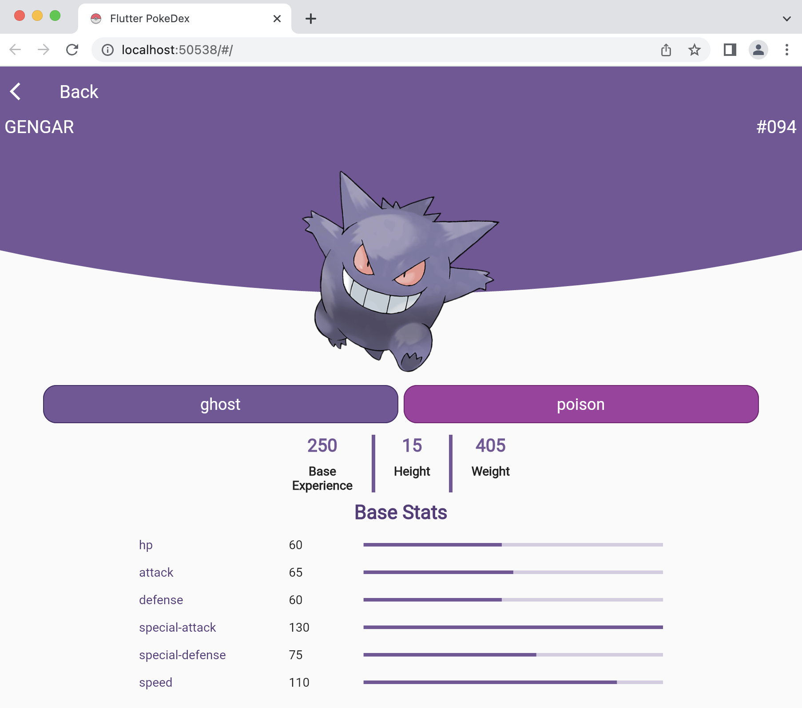

# Pokedex

This project is a Pokedex made with Flutter and uses the [PokeAPI](https://pokeapi.co/docs/v2) to retrieve Pokemon data.  
It follows the Clean Architecture principles, you can find more information about it [here](https://blog.cleancoder.com/uncle-bob/2012/08/13/the-clean-architecture.html).  
And also uses the BLoC pattern for state management.

## Technology Used
- Flutter 3.3.5 • channel stable

## Dependencies
- [cupertino_icons](https://pub.dev/packages/cupertino_icons): Provides Cupertino (iOS-style) icons.
- [bloc](https://pub.dev/packages/bloc): A predictable state management library that helps implement the BLoC pattern.
- [equatable](https://pub.dev/packages/equatable): A package that helps implement equality between objects.
- [flutter_bloc](https://pub.dev/packages/flutter_bloc): A package that helps integrate the BLoC pattern into Flutter.
- [dartz](https://pub.dev/packages/dartz): A functional programming library for Dart.
- [http](https://pub.dev/packages/http): A library for making HTTP requests.
- [responsive_builder](https://pub.dev/packages/responsive_builder): A library for building responsive widgets.

## Features
- Lists all the Pokémon from all generations.
- Displays the details of each Pokémon when clicked.

## Responsive
This project is responsive for both web and mobile and has been tested on Android and the web.

## Demo
- The demo page is available [here](https://alexvma.github.io/pokedex/web/).

## Continuous Integration and Continuous Deployment

This project has CI and CD using GitHub Actions. You can check the status of the build and deployment [here](https://github.com/alexVma/pokedex/actions). The code is linted, formatted, and tested before each commit and deployment.

## Project Status

This project is in development and its current version is beta1. The main features pending are:

1. Generate a local database provider to store favorite Pokémon.
2. An administration module for profile settings.

## Installation Guide

1. Install Flutter following the instructions [here](https://flutter.dev/docs/get-started/install). Make sure to install version 3.3.5 • channel stable.
2. Clone the repository using the following command: `git clone https://github.com/alexVma/pokedex.git`
3. Navigate to the project directory: `cd pokedex`
4. Download the dependencies: `flutter pub get`
5. Run the code on the web: `flutter run -d chrome`

## License

This project is licensed under the MIT License. You can find the full license [here](https://github.com/alexVma/pokedex/blob/main/LICENSE).

## Screenshots

### SmarthPhone
<table border="0" style="border-collapse: collapse; width: 0%; height: 0px;">
<tbody>
<tr style="height: 0px;">
<td style="width: 0%; height: 0px;"></td>
<td style="width: 0%; height: 0px;"></td>
</tr>
</tbody>
</table>

### Web
<table border="0" style="border-collapse: collapse; width: 0%; height: 0px;">
<tbody>
<tr style="height: 0px;">
<td style="width: 0%; height: 0px;"></td>
<td style="width: 0%; height: 0px;"></td>
</tr>
</tbody>
</table>

### Tablet
<table border="0" style="border-collapse: collapse; width: 0%; height: 0px;">
<tbody>
<tr style="height: 0px;">
<td style="width: 0%; height: 0px;"></td>
<td style="width: 0%; height: 0px;"></td>
</tr>
</tbody>
</table>
